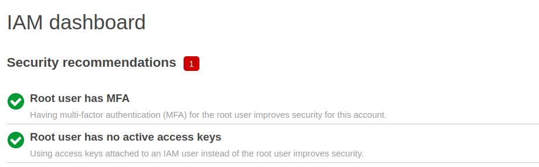
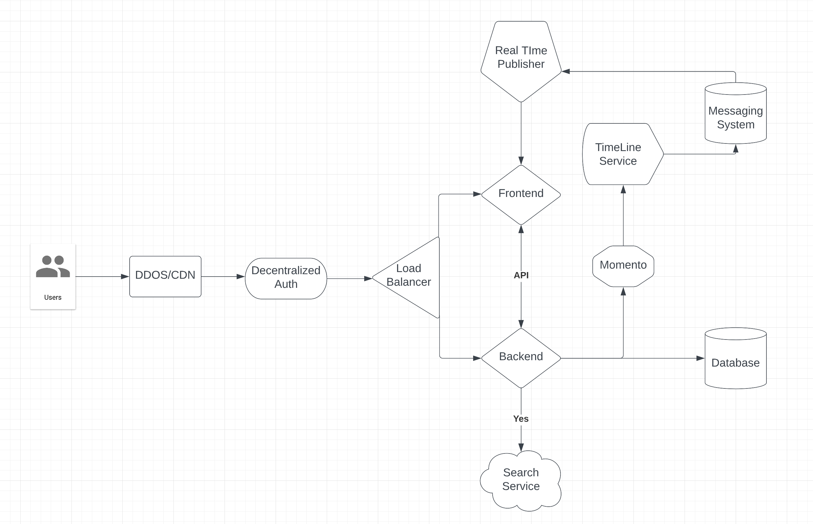
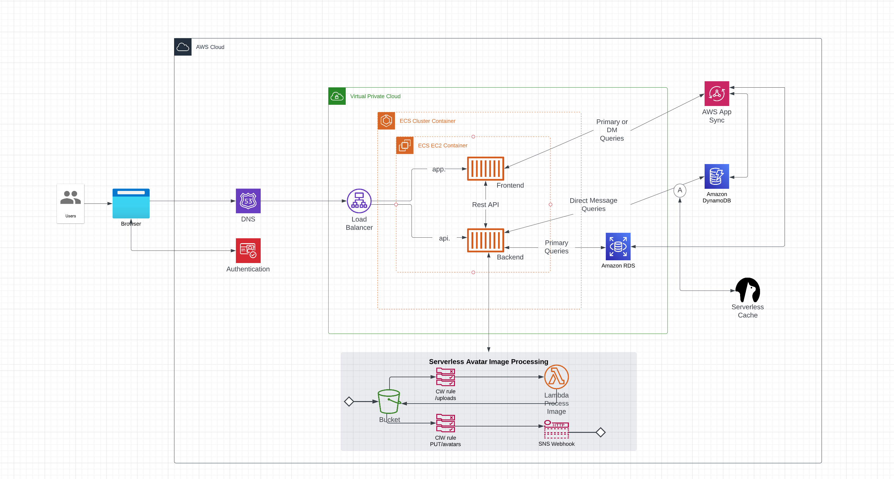

# Week 0 — Billing and Architecture

## Prerequisites
* GitHub Account
* Gitpod Account
* Github Codespaces Account 
* AWS Account
* Momento Account
* Custom Domain Name
* Lucid Charts
* HoneyComb.io
* Rollbar Account

1. Used my existing Github account and used [ExamProCo](https://github.com/ExamProCo/aws-bootcamp-cruddur-2023) repositry as a template.
2. Watched [Gifted Lane's Playlist](https://www.youtube.com/playlist?list=PL6RfZggzDojS8y2RYkvdLcvTd8ZpxEDoT) and opened accounts for[Gitpod](https://gitpod.io/) ,[Momento](https://www.gomomento.com/), [HoneyComb.io](https://www.honeycomb.io/) and [Rollbar](https://rollbar.com)
3. Created a New AWS account to be eligible fro the free tire.
4. Watched [Andrew Brown's video](https://www.youtube.com/watch?v=A6_c-hJmehs) on adding the Gitpod Button.
5. Bought a .link domain for Cohort: 2023-A1.


## Required Homework

1. Was unable to attend the complete Live session as it was very late in my time zone, watched remaining on [Youtube](https://www.youtube.com/watch?v=SG8blanhAOg&list=PLBfufR7vyJJ7k25byhRXJldB5AiwgNnWv&index=13) , Also watched [Generate Credentials, AWS CLI, Budget and Billing Alarm via CLI](https://www.youtube.com/watch?v=OdUnNuKylHg&list=PLBfufR7vyJJ7k25byhRXJldB5AiwgNnWv&index=15) from the same playlist.


Updated my `.gitpod.yml` to include the following:-

```sh
tasks:
  - name: aws-cli
    env:
      AWS_CLI_AUTO_PROMPT: on-partial
    init: |
      cd /workspace
      curl "https://awscli.amazonaws.com/awscli-exe-linux-x86_64.zip" -o "awscliv2.zip"
      unzip awscliv2.zip
      sudo ./aws/install
      cd $THEIA_WORKSPACE_ROOT

```

added my ENV VARS to Gitpod under [variables](https://gitpod.io/user/variables)
* AWS_ACCESS_KEY_ID
* AWS_ACCOUNT_ID
* AWS_DEFAULT_REGION
* AWS_SECRET_ACCESS_KEY

or you can set them in the terminal

```
gp env AWS_ACCESS_KEY_ID=""
gp env AWS_SECRET_ACCESS_KEY=""
gp env AWS_DEFAULT_REGION=us-east-1
gp env AWS_ACCOUNT_ID=
```


Ran ``` aws sts get-caller-identity ```
to confirm my credentials were correct


2. Watched [Chirag's video](https://www.youtube.com/watch?v=OVw3RrlP-sI&list=PLBfufR7vyJJ7k25byhRXJldB5AiwgNnWv&index=14) on Pricing basics and [Ashish's Week 0 - Security Considerations Video](https://www.youtube.com/watch?v=4EMWBYVggQI&list=PLBfufR7vyJJ7k25byhRXJldB5AiwgNnWv&index=16)

 * Activated MFA for root user.

 

3. Setup billing Alarms 
4. Created Conceptual Diagram Cruddur in Lucid Charts.

5. Created Logical diagram for Cruddur in Lucid Charts


## Stretch Homework
1. Terraform billing alarms(to-do)
2. Use boto3 and python and create billing alarms(to-do)
## Blog posts

[dev.to---TODO](https://dev.to/joshdsy)