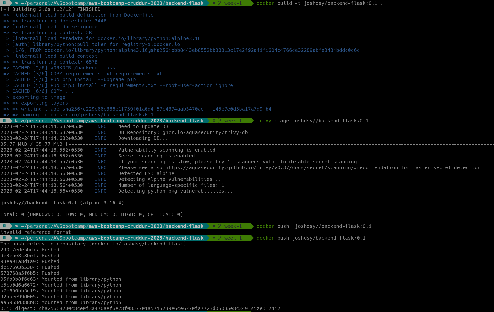
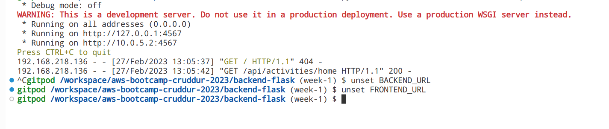
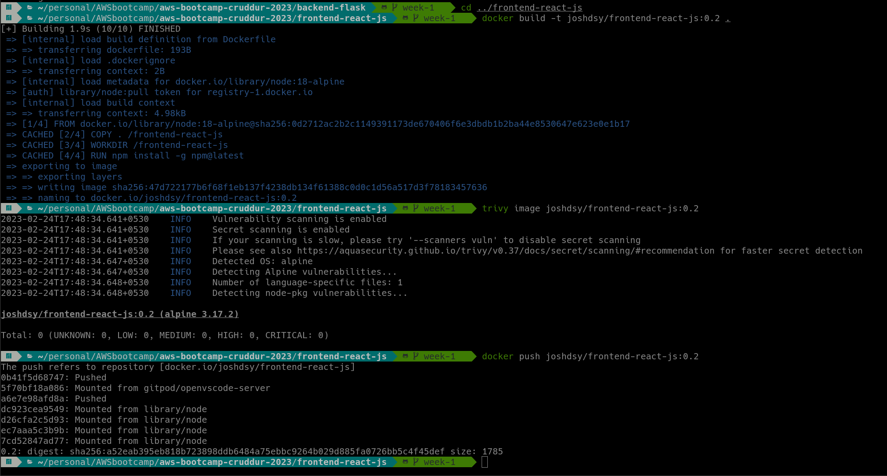
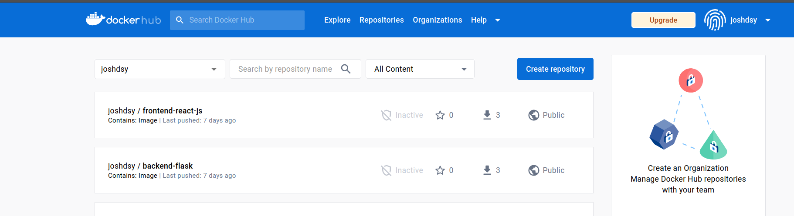
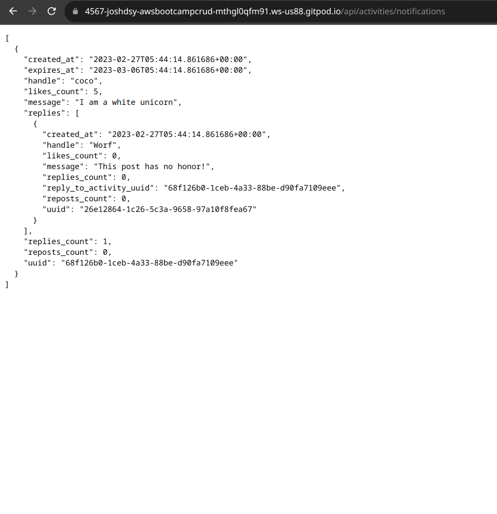

# Week 1 — App Containerization
## Required Homework
* Watched [How to Ask for Technical Help](https://youtu.be/tDPqmwKMP7Y) video.
* Watched [Grading Homework Summaries](https://youtu.be/FKAScachFgk) video.
* Watched [Week 1 Live Recorded Video](https://www.youtube.com/live/zJnNe5Nv4tE?feature=share) 
* Watched [Commit Your Code](https://youtu.be/b-idMgFFcpg) video.
* Watched [Chirag's Week 1 Spend Consideration](https://youtu.be/OAMHu1NiYoI) video.
* Watched [Ashish's Week 1 Security Consideration](https://youtu.be/OjZz4D0B-cA) video.
* Watched [Week 1 - Create the notification feature (Backend and Front)](https://youtu.be/k-_o0cCpksk) video.
* Watched [Week 1 - DynamoDB and Postgres vs Docker](https://youtu.be/CbQNMaa6zTg)

## Containerize Application (Docker files, Docker Compose)

Built Backend container ran Trivy Vulnerability Scanner for Containers to check for Vulnerabilities.
I think I spent(wasted?) alot of time trying to get zero vulnerabilities 

After that did the same with the front end Built ran Trivy Vulnerability Scanner an pushed to DockerHub.

Did a Andrew Brown and Labeled it 0.2 instead of 0.1

Pushed both images to DockerHub

Here I got the backend working.

 
Checked that Postgres was working from the docker-compose.
