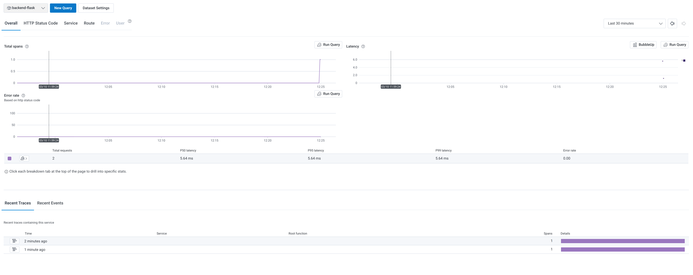

# Week 2 — Distributed Tracing
## Homework

### Video Watched
* Watched [FREE AWS Cloud Project Bootcamp - Update 2023-02-23 Video](https://youtu.be/gQxzMvk6BzM).
* Watched [Week 2 - Live Streamed Video – Honeycomb.io Setup](https://www.youtube.com/live/2GD9xCzRId4?feature=share).

### Work Done
* Setup up Honeycomb as per the video
* After alot of tshooting including adding trying to debug to the console , mixing up my branches
Even adding this  code in  and removing it out  I got spans working .
```
# console standard output
simple_processor = SimpleSpanProcessor(ConsoleSpanExporter())
provider.add_span_processor(simple_processor)
```
I had somehow missed to copy 
```
trace.set_tracer_provider(provider)
tracer = trace.get_tracer(__name__)
```

